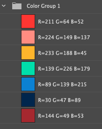
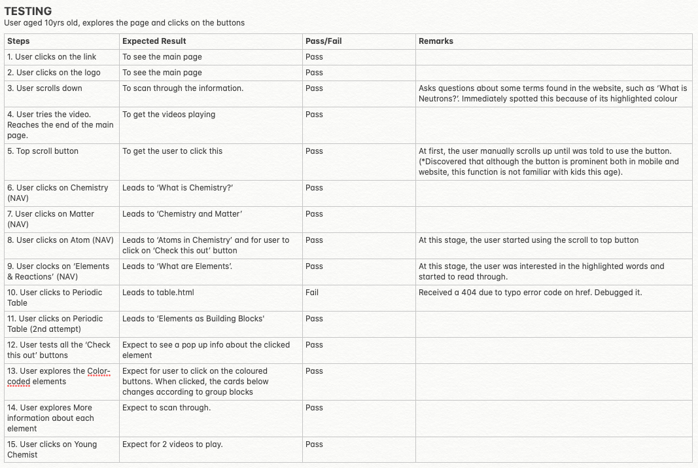

# Science for Kids

## Demo

A live demo of the finished project can be found [here](https://francesjgonzales.github.io/periodicTableProj2/).

---

## Aim

1. Introduce basic foundation of Chemistry to kids.
2. Teach them how to read the Periodic Table.
3. Get them involved in science experiments at home.

---

# UX

### Research and Strategy

#### Stakeholder information:

1. Kids at the age of 10 years old who has the basic foundation of Science.
   - Primary 3 starts taking up science subject.
2. Kids as young as 6 years old can engage in fun experiments.

#### Scope

1. Keep the readers engage
2. User goal: make them reach to periodic table page and explore the elements

How I started.

1. Find out the age on when kids can start learning Chemistry.
   - Primary 3 starts taking up science subject.
2. Introduce the basics of Periodic Table - Primary 4 (10yrs old and above)
3. Add on easy science experiments for younger kids (6yr)

#### Structure1. Refered to [Chem4Kids](http://www.chem4kids.com/) to use as main content on Chemistry.
2. Narrowed down the key topics to the following:
   - About Chemistry
   - Matter
   - Atom
   - Elements & Reaction
     - Periodic Table

**Medium-Fidelity mock up**


#### UI

I researched in [awwwards.com](https://www.awwwards.com/) and [dribbble.com](https://dribbble.com/) for kids websites

1. Fonts - I used 1 type of font that gives a readable look
2. The website consist of main page and 1 sub page.
   - Main page has the following content
     1. Chemistry (introduction)
     2. Matter
     3. Atom
     4. Elements & Reaction (Short for Chemical Reaction)
   - Periodic Table (sub page)
     1. Young Chemist (includes videos about fun experiments.)
3. Colours used are striking and images are more cartoon-like for engagement.
  - Below is the Primary colour palette that is used throughout the website
  - 
4. Original content from Chem4Kids website are mostly in paragraph format. I break the long-winded text and added mark on keywords and inserted images in between to keep the engagement going.
5. This is not responsive and suitable for ipad as periodic table cannot be collapsed. **(Update: Have addressed concerns on mobile responsiveness and is now available for mobile use)**
   

---

## Features

#### The website will feature the following:

**Main page**
   1. Features kid-friendly images where basic information about Chemistry is introduced. Here are the topics used:
      1. What is Chemistry? 
      2. Matter
      3. Atoms
      4. Elements and Chemical Reactions
   
   2. Used infographics to show more visual-aid for kids to catch their attention. 
   3. Interactive buttons under Atom subpage is available to keep the kids engaged. 
   4. Videos about Chemistry is shown and intended to be in last page so that kids can scan through the whole page.
   5. Scroll to top page is available for faster navigation.

**Sub page**
   1. Periodic Table - Since the main page consist of topics that make up the Periodic Table, I separated this in another page. 
   2. Elements as Building Blocks 
      - 4 elements are with clickable button to show facts, history, year discovered, atomic number and atomic name. Pop-up effect is used to keep the kids focused on specific information. 
   3. Under color-coded elements, I categorised them by Group Blocks because of its different categories. What better way to keep kids engage is through colours. 
      - Each group block are based on secondary colours specially for Periodic Table. 
  


#### Features left to implement
- Create interactive quiz on each topics.
- Create a search button to find each elements, where more information will appear.

#### Technologies used

List of tools used for this project:

- [Getbootstrap](https://getbootstrap.com/)
  - The project uses **getbootstrap** to make the site responsive.
- [Fontawesome](https://fontawesome.com/)
  - The project uses **fontawesome** to add icons for contact and footer pages.
- [Powr.io](https://www.powr.io/)
  - The project uses **powr.io** to get more followers in shop's instagram account.
- [Bootstrap’sJavaScript](https://getbootstrap.com/)
  - The project uses **Bootstrap's Javascript** to make animation work in carousel.
- [JQuery]
- [Markdown](https://github.com/adam-p/markdown-here/wiki/Markdown-Cheatsheet#emphasis)
  - The project uses **MarkdownCheatsheet** as quick reference for documenting readme file.
- [AdobeXD](https://www.adobe.com/sea/products/xd.html)
  - The project uses **AdobeXD** as wireframing tool for creating medium-fidelity mock up and converting images for web.
- [HTML5] For consistent rendering in every browser.
- [LanguageAttribute] For translation tools to determine what rules to use.
- [CSS3]
- [MediaQuery] Added breakpoints for parts of the design that is different.
- [Illustrator] For designing elements and main page.

---

## Testing

I shared this with my 10 year old son. Noticed his reaction has stopped on the part with videos.
These instructions / questions where given and asked to him while browsing the website.

- What is the website about?
- Do you understand what it is about?
- Which part do you like the most in the website?

Below is a detailed steps when user tested the website. Click [here](https://github.com/francesjgonzales/periodicTableProj2/blob/master/readme/testing.jpg) for clearer view.
	

---

## Deployment

First, I used **Visual Studio** Code to create my first file locally where I created the html, css and javascript files. 

I used **Github** to create and deply my projects. Here are the step by step process I did.

  **Create Repository**
1. Login to [github](https://github.com/)
2. In main page, click on **New** button found in upper left corner. 
3. In repository name, type your project name. 
4. Select as public
5. In *initialise this repository with*, select **Add a README file**
6. Click on **Create Repository**
7. In the created repository, click on **Add file** to upload local files. 

**Deploy site to Github from Visual Code**
1. Save file from local drive.
2. Go to source control, click the plus sign and type your meaningful commit message and click the tick sign to commit. 
3. Go to terminal and type `git push`
4. Go to [github](https://github.com/) account to check.
5. Click on this [link](https://francesjgonzales.github.io/periodicTableProj2/) to view the deployed site


---

## Credits

### Content

1. Videos used

   - [10 Easy Science Experiments - That Will Amaze Kids by Raising da Vinci](https://www.youtube.com/watch?v=4MHn9Q5NtdY)
   - [What Is An Atom? | The Dr. Binocs Show | Best Learning Videos For Kids by Peekaboo Kidz](https://www.youtube.com/watch?v=jMW_0Ro6b5c)
   - [Good Thinking! — Chemical Reactions in Action by Smithsonian Science Education Center](https://www.youtube.com/watch?v=5iowJs6MryI)
   - [Easy Science Experiments for kids by Mr Duck](https://www.youtube.com/watch?v=McVpXiSttnU)
   - Javascript Tutorials
     - [Fetch API & Rendering Data with JavaScript](https://www.youtube.com/watch?v=FN_ffvw_ksE)
     - [Javascript search bar](https://www.youtube.com/watch?v=wxz5vJ1BWrc)
     - [Group by](https://www.youtube.com/watch?v=iBGUyPwm_dM)
     - [Display JSON data in table](https://www.youtube.com/watch?v=WMQ2sq1dw6Y&t=214s)
     - [JSON data array value access](https://www.youtube.com/watch?v=HdFYtHJDGd8)
     - [Scroll to Top by rdallaire of codepen](https://codepen.io/rdallaire/pen/apoyx)
     - [Pop up box](https://www.youtube.com/watch?v=MBaw_6cPmAw&t=177s)

2. Content used - [Chem4Kids](http://www.chem4kids.com/) The grammar used is relatable and easy to understand.
3. I referred to [w3schools](w3schools.com) for text styling and table format
4. [Whitespaces in div id](https://stackoverflow.com/questions/9285451/handling-css-id-and-classes-with-spaces)
5. Accordion - I want to credit my mentor, **Arif** for sharing his code on this. 
```
$("#allCollapse").collapse('show');
changeBtnColor();
$("button[name='allCollapse']").addClass("btn btn-primary");

function changeBtnColor() {
    $(".infoCollapse").removeClass("btn btn-primary");
    $(".infoCollapse").addClass("btn btn-primary");
}

function toggleFunction(name) {
    $(".collapse").collapse('hide');
    changeBtnColor();
    setTimeout(function () { openSelected(name) }, 360);
}

function openSelected(name) {
    btnSelection = "button" + "[name=" + name + "]";
    $(btnSelection).addClass("btn btn-primary");
    selection = "#" + name;
    $(selection).collapse("toggle");
}
```

### Media

- The images used are from freepik
  - Vectors by [brgfx](https://www.freepik.com/brgfx), [macrovector](https://www.freepik.com/macrovector)
  - Teacher with kids photo by [gorynvd](https://www.freepik.com/gorynvd)
  - [Reference for parents
    Chemistry For Kids Doesn’t Have To Be Boring](https://www.superprof.com/blog/what-is-chemistry-for-kids/)

Inspiration layouts

1. Wonderschool by Lorena G 
- Inspired by its clean and simple layout 
- The colour palette used here is striking and adapted some colours to the website. 
   

   

### Acknowledgements

- This website is dedicated to my son and two nephews.
